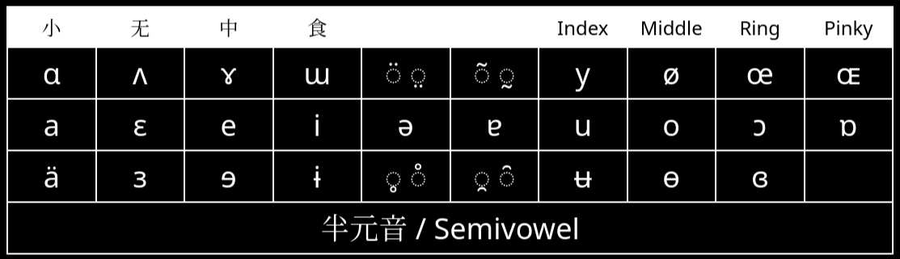
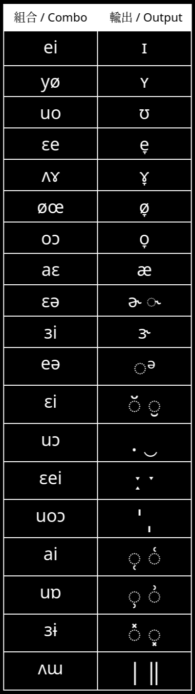
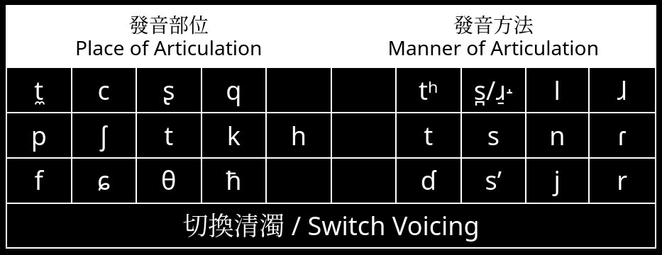
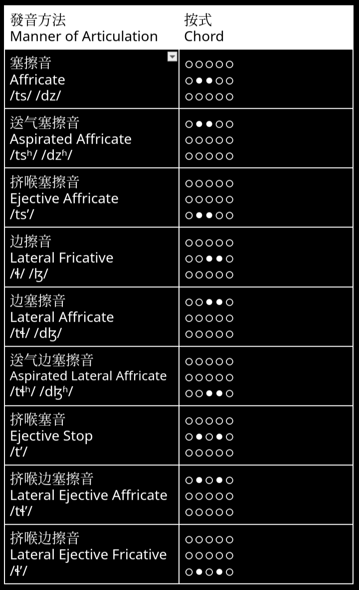
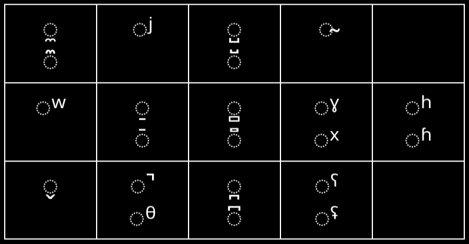
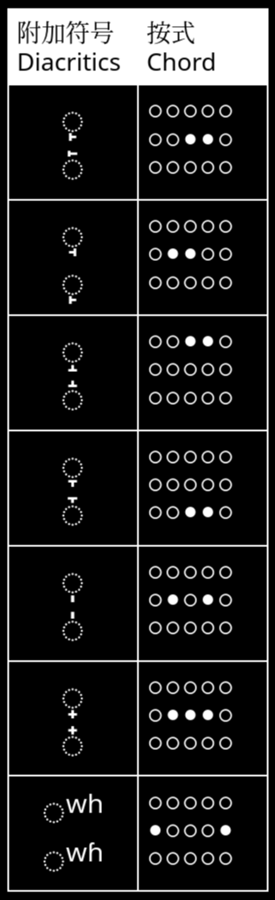
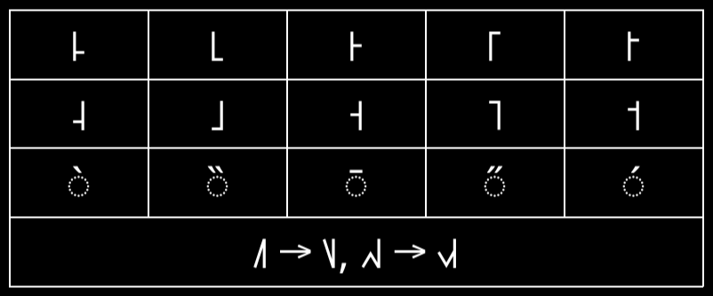
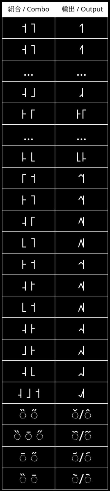

# 人音竝擊 / Combo IPA

## 元音 / Vowel





## 輔音 / Consonant





## 附加符號 / Diacritics

按式：
```
○○○○○ ○○○○○
○○○○○ ○●●●○
○○○○○ ○○○○○
```





## 聲調 / Tone

按式：
```
○○○○○ ○○○○○
○○○○○ ○●○○●
○○○○○ ○○○○○
```





## 待辦 / Todo

- [x] Clicks
- [ ] Brackets
- [x] Suprasegmentals
- [x] Tone
- [x] Diacritics
